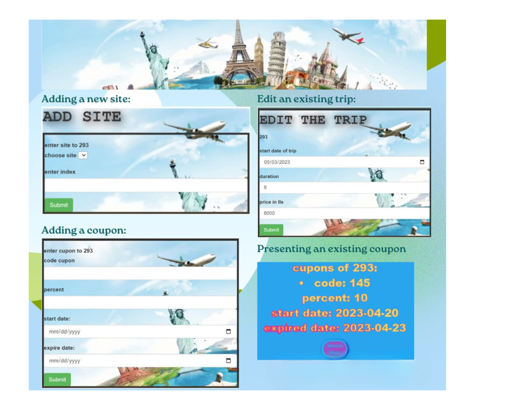

# Travel-Management-System
Management of a website for booking trips.

This project implements a management system for a travel company that allows storing and managing information about trips organized by the company.  
The system uses a MongoDB database to store the data in the cloud. The company offers trips on various routes, which can be purchased using different discount coupons.,
This system provides a comprehensive solution to manage the entire process from trip planning to booking and payment.

    

